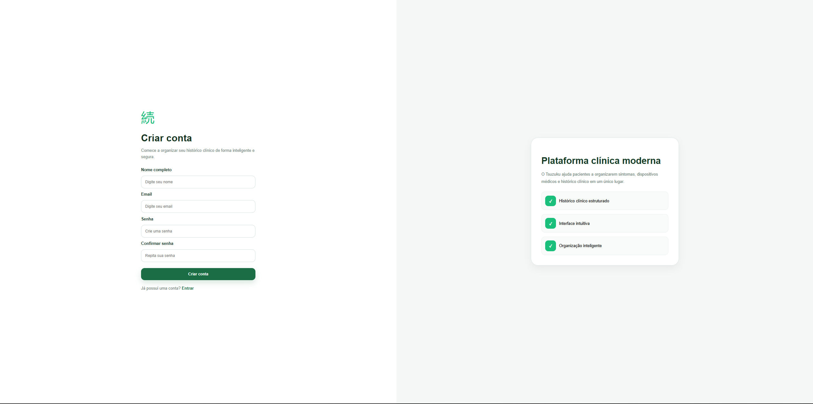
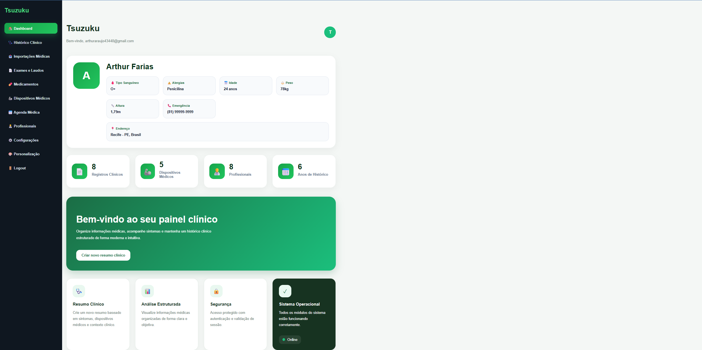
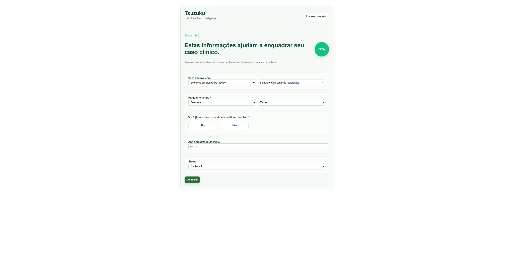
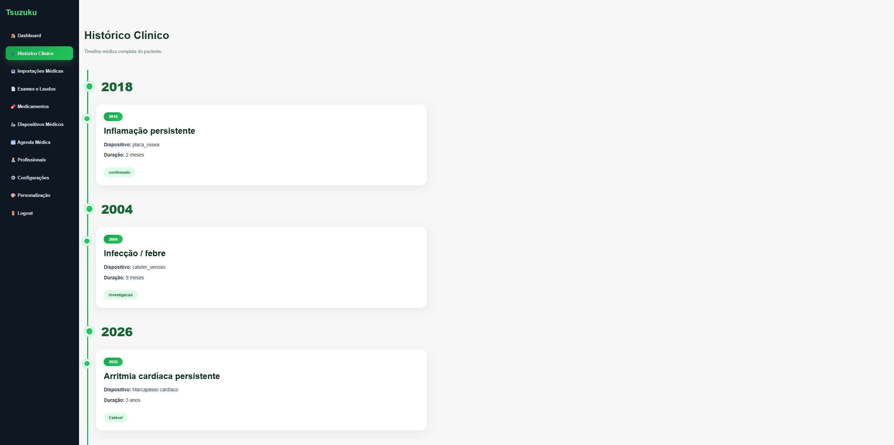

# 🩺 Tsuzuku

[](https://tsuzuku.onrender.com)

Sistema web desenvolvido em **Python + Flask** para auxiliar pacientes e profissionais da saúde na organização de informações clínicas, geração de resumos médicos e gerenciamento do histórico de atendimentos.

---

## 🚀 Demonstração Online

🔗 **Acesse a aplicação:**

**https://tsuzuku.onrender.com**

> **Observação:** Como o projeto está hospedado no plano gratuito do Render, a primeira abertura pode levar alguns segundos.

---

## 🛠 Tecnologias Utilizadas


---

# ✨ Funcionalidades

- 👤 Cadastro de usuários
- 🔐 Sistema de autenticação (Login)
- 📋 Dashboard do usuário
- 🩺 Criação de resumos clínicos
- 📚 Histórico de resumos
- 📄 Upload de documentos
- 🧪 Gerenciamento de exames
- 📱 Interface responsiva

---

# 📸 Demonstração

## Tela Inicial


---

## Login


---

## Cadastro



---

## Dashboard



---

## Resumo Clínico



---

## Histórico



---

# 📂 Estrutura do Projeto

```text
Tsuzuku_App_Madu/
│
├── static/
│   ├── css/
│   └── img/
│
├── templates/
│
├── uploads/
│
├── screenshots/
│
├── app.py
├── database.py
├── requirements.txt
├── Procfile
├── README.md
└── .gitignore
```

---

# ⚙️ Como executar localmente

### 1. Clone o repositório

```bash
git clone https://github.com/KEB3C/tsuzuku.git
```

### 2. Entre na pasta

```bash
cd tsuzuku
```

### 3. Instale as dependências

```bash
pip install -r requirements.txt
```

### 4. Execute a aplicação

```bash
python app.py
```

### 5. Acesse

```
http://localhost:5000
```

---

# ☁️ Deploy

O projeto está publicado utilizando:

- Render
- Gunicorn

Aplicação online:

**https://tsuzuku.onrender.com**

---

# 🚧 Próximas Funcionalidades

- [ ] Exportação de resumos em PDF
- [ ] Banco de dados PostgreSQL
- [ ] Integração com IA para geração automática de resumos
- [ ] Dashboard com estatísticas
- [ ] Perfil do usuário
- [ ] Recuperação de senha
- [ ] Melhorias na experiência do usuário (UX/UI)

---

# 👨‍💻 Autor

**Arthur Farias**

GitHub:

https://github.com/KEB3C

LinkedIn:

[(Seu LinkedIn)](https://www.linkedin.com/in/arthur-farias-dev/)

---

# 📄 Licença

Este projeto foi desenvolvido para fins acadêmicos e de portfólio.
